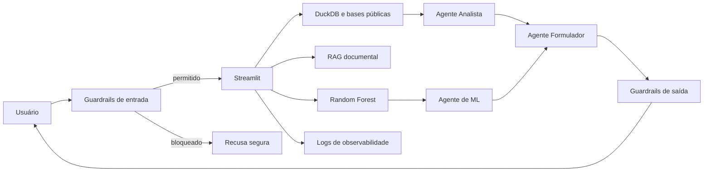

# RE[INOVE]® Decision Lab Público

Plataforma inteligente para transformar dados públicos dispersos em diagnósticos, previsões e recomendações rastreáveis para políticas públicas.

## Desafio CBL

**Grande ideia:** inteligência artificial, bases públicas e arquitetura de decisão aplicadas à melhoria das políticas públicas.

**Pergunta essencial:** como um sistema inteligente pode transformar dados públicos dispersos em decisões claras, rastreáveis e orientadas por evidências?

**Desafio:** desenvolver uma plataforma interativa que integre bases públicas, documentos, Machine Learning, RAG e agentes especializados para apoiar formulação, priorização e monitoramento de políticas públicas.

## Arquitetura



## Componentes

- Streamlit para interface pública
- DuckDB e Pandas para dados estruturados
- Random Forest para risco de baixa empregabilidade
- três agentes especializados
- RAG documental local
- guardrails de entrada e saída
- anonimização de CPF, e-mail e telefone
- Golden Dataset e testes automatizados
- observabilidade em JSONL

## Segurança

A camada `src/security.py` verifica prompt injection, jailbreak, comandos perigosos, tópicos operacionais proibidos, tamanho excessivo e possíveis segredos na saída. PII é anonimizada antes do processamento. O arquivo `golden_dataset/golden_dataset.jsonl` inclui solicitações legítimas, três ataques e um caso de PII.

## Execução local

Recomendado: Python 3.13 (também compatível com versões suportadas pelas dependências).

```bash
python -m venv .venv
# Windows: .venv\Scripts\activate
pip install -r requirements.txt
pytest
python scripts_evaluate_golden.py
streamlit run app.py
```

## Variáveis de ambiente

Copie `.env.example` para `.env` apenas localmente. O arquivo `.env` está ignorado pelo Git. A integração com LM Studio é opcional; na ausência dela, o sistema utiliza o mecanismo analítico local.

## Resultados do modelo

- Accuracy: 87,23%
- Precision: 87,50%
- Recall: 87,50%
- F1: 87,50%
- ROC-AUC: 92,66%

## Testes

```bash
pytest
python scripts_evaluate_golden.py
```

## Deploy

O projeto contém `Dockerfile`, `Procfile` e configuração Streamlit. Pode ser publicado no Streamlit Community Cloud, Render ou Railway. No deploy, segredos devem ser cadastrados nas variáveis da plataforma e nunca gravados no repositório.

## Limitações

- Alguns cards do MVP usam estimativas transparentemente identificadas.
- Conectores de bases externas dependem de disponibilidade e formato das APIs.
- LM Studio é local e opcional, portanto não está disponível automaticamente em hospedagem pública.
- O classificador foi treinado com um recorte limitado e não substitui avaliação humana ou estudos causais.
- Os guardrails baseados em regras cobrem ataques conhecidos, mas não eliminam integralmente riscos adversariais.

## Evoluções previstas

1. substituir estimativas por pipelines oficiais versionados em Parquet e validação de qualidade;
2. incorporar monitoramento remoto com Langfuse e métricas de latência, custo e qualidade;
3. ampliar o Golden Dataset e usar avaliação semântica contínua;
4. adicionar autenticação, perfis de acesso e trilha de auditoria imutável;
5. publicar modelos por domínio, com explicabilidade SHAP e revisão humana.

## Autoria

Aline Balta Vianna — disciplina **AI Factory: Building Intelligent Systems**, PUCPR.
